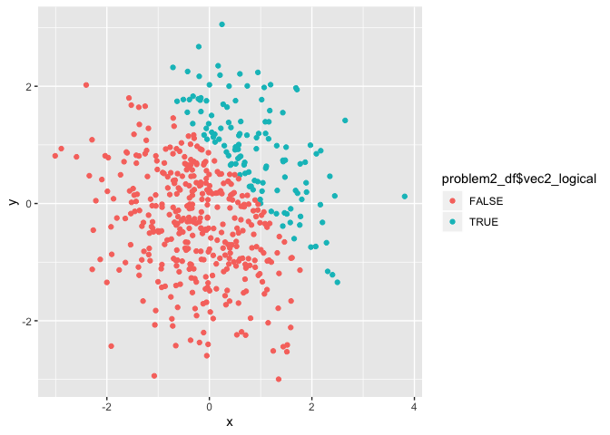
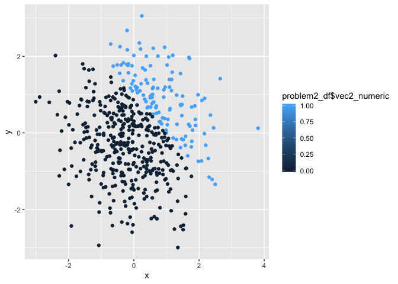
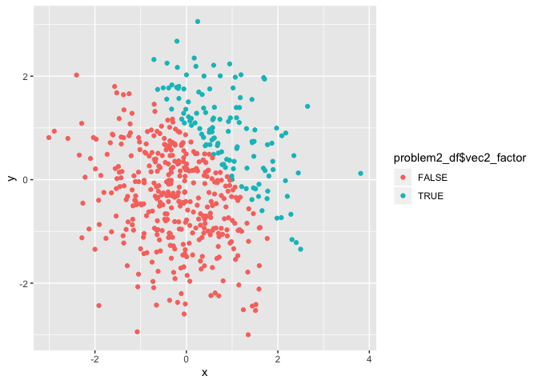

p8105\_hw1\_jy2965
================
Jun Yin
2019-09-19

## Problem 1

## Create a data frame

The chunk below creates a dataframe containing a random sample of size 8
from a standard Normal distribution, a logical vector indicating whether
elements of the sample are greater than 0, a character vector of length
8 and a factor vector of length 8, with 3 different factor
    “levels”.

``` r
library(tidyverse)
```

    ## ── Attaching packages ────────────────────────────────────────── tidyverse 1.2.1 ──

    ## ✔ ggplot2 3.2.1     ✔ purrr   0.3.2
    ## ✔ tibble  2.1.3     ✔ dplyr   0.8.3
    ## ✔ tidyr   0.8.3     ✔ stringr 1.4.0
    ## ✔ readr   1.3.1     ✔ forcats 0.4.0

    ## ── Conflicts ───────────────────────────────────────────── tidyverse_conflicts() ──
    ## ✖ dplyr::filter() masks stats::filter()
    ## ✖ dplyr::lag()    masks stats::lag()

``` r
set.seed(1)
problem1_df = tibble(
  vec_numeric = rnorm(8),
  vec_logical = vec_numeric>0,
  vec_char = c("My", "name", "is", "Jun","trying","to","get","eight"),
  vec_factor = factor(c("chocolate", "chocolate", "cookie", "cookie","cookie","cake","cake","cake"))
)
#I show the class and level of factor variables.
class(problem1_df$vec_numeric)
```

    ## [1] "numeric"

``` r
class(problem1_df$vec_logical)
```

    ## [1] "logical"

``` r
class(problem1_df$vec_char)
```

    ## [1] "character"

``` r
class(problem1_df$vec_factor)
```

    ## [1] "factor"

``` r
levels(problem1_df$vec_factor)
```

    ## [1] "cake"      "chocolate" "cookie"

``` r
mean(problem1_df$vec_numeric)
```

    ## [1] 0.1314544

``` r
mean(problem1_df$vec_logical)
```

    ## [1] 0.625

``` r
mean(problem1_df$vec_char)
```

    ## Warning in mean.default(problem1_df$vec_char): argument is not numeric or
    ## logical: returning NA

    ## [1] NA

``` r
mean(problem1_df$vec_factor)
```

    ## Warning in mean.default(problem1_df$vec_factor): argument is not numeric or
    ## logical: returning NA

    ## [1] NA

Result: I could get the mean of numeric and logical variables, but I can
not get the mean of character and factor variables.

Explanation: Because the numeric variable is a set of numbers, it is
easy to calculate the mean of it. As for logical variables, the system
recognizes TRUE as 1 and FALSE as 0, so it can calculate the mean of a
set of number 1 and 0. However, sice character and factor variables are
sets of words instead of numbers, the system cannot calculate the means
of them.

## data conversion

``` r
as.numeric(problem1_df$vec_logical)
as.numeric(problem1_df$vec_char)
as.numeric(problem1_df$vec_factor)
```

Results: I could get a valid results when I converted the logical
variable to numeric variables. I could get a valid results when I
converted the factor variable to numeric variables. However, I can not
get a valid results when I convert charactor variable to numeric
variable. Because the system saves logical variables True as 1 and False
as 0, which we could convert it to numeric variables. And factors in R
are stored as a vector of integer values with a corresponding set of
character values to use when the factor is displayed, which we could
convert it to numeric variables. But for charactor variables are saved
as words. I think it does help explain what happens when I try to take
the mean.

**chunk2**

This chunk shows the conversion of different types of
variables.

``` r
as.numeric(problem1_df$vec_logical)#convert the logical vector to numeric
```

    ## [1] 0 1 0 1 1 0 1 1

``` r
as.numeric(problem1_df$vec_logical)*problem1_df$vec_numeric#multiply the random sample by results
```

    ## [1] 0.0000000 0.1836433 0.0000000 1.5952808 0.3295078 0.0000000 0.4874291
    ## [8] 0.7383247

``` r
as.factor(problem1_df$vec_logical)#convert the logical vector to a factor
```

    ## [1] FALSE TRUE  FALSE TRUE  TRUE  FALSE TRUE  TRUE 
    ## Levels: FALSE TRUE

``` r
as.factor(problem1_df$vec_logical)*problem1_df$vec_numeric#multiply the random sample by results
```

    ## Warning in Ops.factor(as.factor(problem1_df$vec_logical),
    ## problem1_df$vec_numeric): '*' not meaningful for factors

    ## [1] NA NA NA NA NA NA NA NA

``` r
as.numeric(as.factor(problem1_df$vec_logical))#convert the logical vector to a factor and then convert the result to numeric
```

    ## [1] 1 2 1 2 2 1 2 2

``` r
as.numeric(as.factor(problem1_df$vec_logical))*problem1_df$vec_numeric#multiply the random sample by results
```

    ## [1] -0.6264538  0.3672866 -0.8356286  3.1905616  0.6590155 -0.8204684
    ## [7]  0.9748581  1.4766494

## Problem 2

# create datafram

This data fram comprised of: x: a random sample of size 500 from a
standard Normal distribution y: a random sample of size 500 from a
standard Normal distribution A logical vector indicating whether x + y
\> 1 A numeric vector created by coercing the above logical vector A
factor vector created by coercing the above logical vecto

``` r
problem2_df = tibble(
  x = rnorm(500),
  y = rnorm(500),
  vec2_logical = x+y > 1,
  vec2_numeric = as.numeric(vec2_logical),
  vec2_factor = as.factor(vec2_logical) 
)
```

## inline R code

As the data frame shows above, *the number of the rows of the dataset*
is 500, *the number of the column of the dataset* is 5; *the mean of x*
is 0.0196843, *the median of x* is-0.0384371, *the standard divation of
x* is 1.0137029; Besides, *the proportion of cases for which x + y \> 1*
is 0.252.

\#\#scatterplot \#\#\# scatterplot of y vs x with the color points using
the logical
variable

``` r
ggplot(problem2_df, aes(x = x, y = y, color = problem2_df$vec2_logical)) + geom_point()
```

<!-- -->

``` r
ggsave("scatterplot_with_color_points_of_logical_variable.png")
```

    ## Saving 7 x 5 in image

From the scatterplot above, we could find that nearly 50% of the logical
variables are true and 50% are
false.

### scatterplot of y vs x with the color points using the numeric variable

``` r
ggplot(problem2_df, aes(x = x, y = y, color = problem2_df$vec2_numeric)) + geom_point()
```

<!-- -->
From the scatterplot above, we could find that nearly 50% of the numeric
variables equal 1 and 50% equal
0.

### scatterplot of y vs x with the color points using the factor variable

``` r
ggplot(problem2_df, aes(x = x, y = y, color = problem2_df$vec2_factor)) + geom_point()
```

<!-- -->
From the scatterplot above, we could find that nearly 50% of the factor
variables are ture and 50% are false.

And we could see that scatterplot1 and scatterplot3 are the same since
they use True and False to differentiate points. But for the
scaterplot2, we could see there are 1 and 0 which are used to
differentiate points and there is a scale spectrum to describe the
numbers between 0 to 1. Since we only hace 2 numbers in our variable
set, we could see 0 and 1 in our plot, but if in other set we have a
0.5, we could also show it in the plot with a different color.
